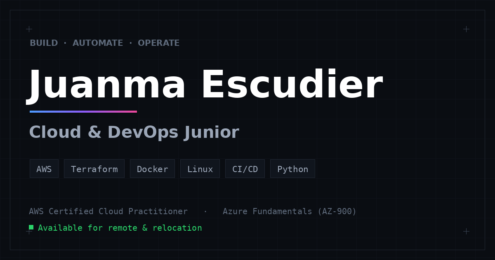

# Juanma Escudier — Portfolio



[](https://www.juanmaescudier.com)
[](#)
[](#)
[](#)
[](https://pages.cloudflare.com/)
[](#)

Personal portfolio for **Juan Manuel Escudier Vázquez** — Cloud & DevOps Engineer.
A fast, static, framework-free site built from scratch with **HTML5, CSS3 and vanilla JavaScript**, deployed on **Cloudflare Workers & Pages**.

🔗 **Live:** https://www.juanmaescudier.com

---

## About

A multi-page portfolio designed to read like it was built by an engineer, not a marketing agency — a dark, minimal, "engineering" aesthetic (Vercel / Linear / Stripe inspired) with sharp corners, a subtle grid, the **Geist** typeface and a restrained blue→violet→pink gradient reserved for focal points.

It targets roles such as Cloud Engineer, DevOps Engineer, Platform Engineer, Infrastructure Engineer and Systems Engineer.

## Features

- **Bilingual (EN/ES)** — instant language toggle, preference persisted in `localStorage`, with automatic detection from the browser language.
- **Multi-page** — Home, Skills & Learning Lab, Projects, a dedicated project case study, and Contact.
- **Custom AWS architecture diagrams** — hand-built inline SVG with recognizable AWS service icons (S3, CloudFront, API Gateway, Lambda, DynamoDB, IAM) plus the CI/CD pipeline.
- **Responsive & mobile-first** — fluid layouts, hamburger menu, horizontally scrollable diagrams with a swipe hint.
- **Accessible** — semantic HTML, skip link, ARIA attributes, visible focus states and `prefers-reduced-motion` support.
- **SEO-ready** — per-page meta, Open Graph & Twitter cards, JSON-LD (`Person` + `SoftwareSourceCode`), `sitemap.xml` and `robots.txt`.
- **Fast & lightweight** — no frameworks, no build step, no runtime dependencies. Only Google Fonts is loaded externally.
- **Subtle, professional motion** — IntersectionObserver reveal animations and animated progress bars.

## Tech stack

| Layer | Choice |
|-------|--------|
| Markup | HTML5 (semantic) |
| Styles | CSS3 — custom properties, grid/flexbox, no preprocessor |
| Behaviour | Vanilla JavaScript (ES5-safe, single IIFE) |
| Type | [Geist](https://vercel.com/font) + Geist Mono |
| Graphics | Inline SVG (icons, diagrams, favicon, OG image) |
| Hosting | Cloudflare Workers & Pages |

## Project structure

```text
.
├── index.html                      # Home — hero, about, certifications, career timeline
├── skills.html                     # Skills matrix (AWS, Azure, DevOps, Infra, Programming) + Learning Lab
├── projects.html                   # Projects overview
├── project-jazz-en-la-jungla.html  # Case study — full AWS architecture diagram
├── contact.html                    # Contact (email · LinkedIn · GitHub)
├── favicon.svg
├── robots.txt                      # Crawler rules
├── sitemap.xml                     # Search-engine sitemap
├── _headers                        # Cloudflare security headers & caching
├── README.md
└── assets/
    ├── css/
    │   └── styles.css              # Design system & all styles
    ├── js/
    │   └── script.js               # i18n engine, navigation, animations
    ├── img/
    │   └── og-image.png            # Social share / banner image
    └── docs/
        └── Juan-Manuel-Escudier-CV.pdf
```

## Run locally

No build step — it's a static site. Pick any of these:

```bash
# Option 1 — Python
python3 -m http.server 8080

# Option 2 — Node
npx serve .

# Option 3 — just open index.html in a browser
```

Then visit `http://localhost:8080`.

## Deployment (Cloudflare Workers & Pages)

The site is deployed as a static project on **Cloudflare Pages**:

1. Push this repository to GitHub.
2. In the Cloudflare dashboard go to **Workers & Pages → Create → Pages → Connect to Git** and select the repo.
3. Build settings:
   - **Framework preset:** `None`
   - **Build command:** *(leave empty)*
   - **Build output directory:** `/` *(repository root)*
4. **Save and Deploy.** Every push to the production branch triggers a new deployment.
5. Add the custom domain under **Pages project → Custom domains** (`juanmaescudier.com` / `www.juanmaescudier.com`).

Security headers and asset caching are configured in [`_headers`](_headers).

## Customisation

- **Translations** live in the `I18N` dictionary at the top of [`assets/js/script.js`](assets/js/script.js). Each entry is `{ en, es }`; mark any text node with `data-i18n="key"` to make it translatable.
- **Theme tokens** (colours, spacing, fonts, gradient) are CSS custom properties in the `:root` block of [`assets/css/styles.css`](assets/css/styles.css).
- **SEO/domain:** canonical URLs, Open Graph and the sitemap reference `https://www.juanmaescudier.com`.

## License & credits

Source code is available for reference and learning — feel free to take inspiration.
Personal content (CV, copy, branding and the *Jazz en la Jungla* case study) © 2026 **Juan Manuel Escudier Vázquez**.

---

<p align="center"><sub>Built with HTML, CSS & JavaScript · deployed on Cloudflare Pages</sub></p>
